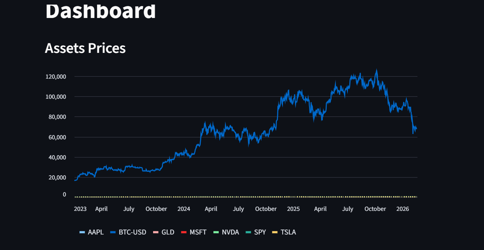
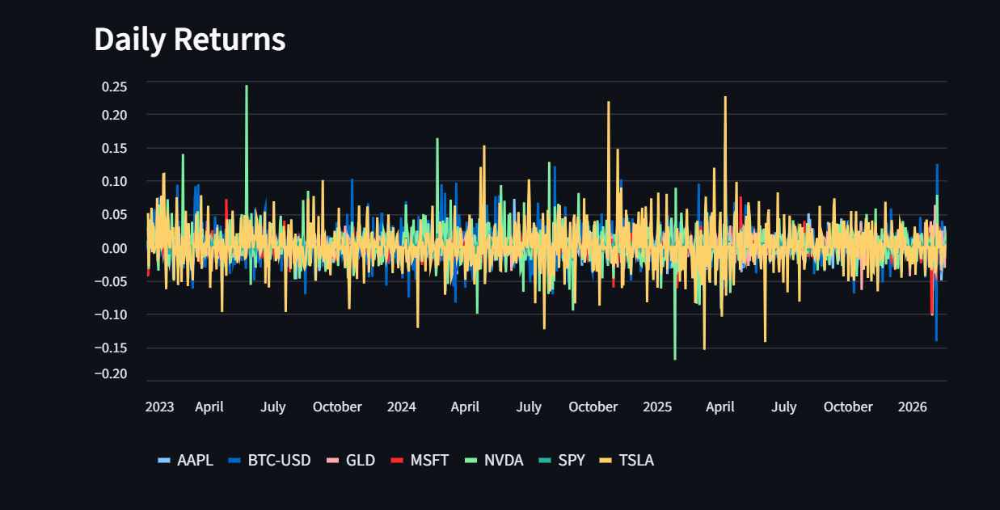

# Investment--Dashboard

## Project Overview
This dashboard focuses on monitoring and analyzing a personal investment portfolio using real-time financial data. 
The main goal is to provide investors with insights into asset prices, daily returns, and portfolio risk, allowing them 
to make informed decisions. The dashboard is interactive, enabling users to select specific assets and adjust 
portfolio weights to see the effect on risk and return in real-time.

## Data Source
All financial data is fetched live from Yahoo Finance using the yfinance Python library. This includes daily prices 
for selected stocks from 2023 to 2026. Using an API ensures that the data is up-to-date and accurate, eliminating the 
need for manually maintained datasets.

## Steps & Methodology
1. Data Collection: Used yfinance to download historical daily prices for selected assets.
2. Data Processing: Calculated daily returns and normalized asset prices.
3. Dashboard Design: Created interactive charts for asset prices and daily returns using Plotly integrated 
   within a Streamlit app.
4. Interactivity: Added an Asset Selector to choose which assets to display and a Portfolio Weights Slider 
   to analyze portfolio risk and return.
5. Deployment: Hosted live on Streamlit Cloud for shareable, interactive access.

## Dashboard Screenshots

## Key Insights
- Real-time visualization of asset performance helps identify trends quickly.
- Portfolio weight adjustments provide immediate feedback on risk & return trade-offs.
- Interactive elements make it easy for non-technical stakeholders to understand portfolio behavior.

## Live Dashboard Link
[Click here to view the live dashboard](https://share.streamlit.io/eng1e/Investment--Dashboard/main/app.py)

## Assumptions & Limitations
- Assumes Yahoo Finance data is accurate and complete for selected assets.
- Only includes assets defined in the dashboard; new assets require code updates.
- Dashboard shows historical trends and daily returns but does not provide financial advice.